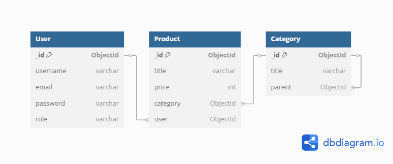

# AUVNET E-commerce Backend API

A complete E-commerce backend system built with Node.js and Express.js using MongoDB. It supports product and category management (with up to 3 nested levels), wishlist functionality, secure JWT authentication, and clear separation of user/admin roles.

---

## 🚀 **Key Features**

- **Secure JWT authentication** (Sign up / Login)
- **Product and multi-level category management (up to 3 levels)**
- **Wishlist for each user**
- **Role-based access control (User/Admin)**
- **Pagination for all GET APIs**
- **Password hashing with bcryptjs**
- **Data validation with express-validator**
- **Comprehensive API documentation (Postman)**
- **ERD included**

---

## 🛠️ **Tech Stack**

- Node.js + Express.js
- MongoDB + Mongoose
- JWT (JSON Web Tokens)
- bcryptjs
- express-validator
- Postman (API documentation)
- (Optional: Deployment on Render/Railway)

---

## ⚙️ **Getting Started Locally**

1. **Clone the repository:**

   ```bash
   git clone https://github.com/your-username/AUVNET-Backend-Internship-Assessment.git
   cd AUVNET-Backend-Internship-Assessment
   ```

2. **Install dependencies:**

   ```bash
   npm install
   ```

3. **Set up environment variables:**

   - Create a `.env` file in the root directory and add:
     ```
     MONGO_URI=your-mongodb-uri
     JWT_SECRET=your-jwt-secret
     JWT_EXPIRE=30d
     ```
   - You can use the `.env.example` file as a reference.

4. **Run the server:**
   ```bash
   npm run dev
   ```
   or
   ```bash
   node server.js
   ```

---

## 👤 **Default Admin Credentials**

- **Username:** admin
- **Email:** admin@admin.com
- **Password:** admin

---

## 📚 **API Documentation**

- All endpoints are documented in the Postman collection:
  - [AUVNET-Backend-Internship-Assessment-Documentation](https://documenter.getpostman.com/view/34351164/2sB2xBEAam)
- Import the collection into Postman to test all endpoints.

---

## 🗂️ **Main Endpoints**

### **Auth**

- `POST /api/v1/auth/signup` — Register a new user
- `POST /api/v1/auth/login` — Login (by email or username)

### **Products**

- `GET /api/v1/products` — Get all products (with pagination)
- `POST /api/v1/products` — Add a product (User only)
- `PUT /api/v1/products/:id` — Update a product (Owner or Admin)
- `DELETE /api/v1/products/:id` — Delete a product (Owner or Admin)

### **Categories**

- `GET /api/v1/categories` — Get all categories (with nested tree support)
- `POST /api/v1/categories` — Add a category (Admin only)
- `PUT /api/v1/categories/:id` — Update a category (Admin only)
- `DELETE /api/v1/categories/:id` — Delete a category (Admin only)

### **Wishlist**

- `POST /api/v1/wishlist` — Add a product to wishlist
- `GET /api/v1/wishlist` — Get wishlist
- `DELETE /api/v1/wishlist/:productId` — Remove product from wishlist

### **Users (Admin Only)**

- `GET /api/v1/users` — Get all users
- `DELETE /api/v1/users/:id` — Delete a user

---

## 🗺️ **ERD (Entity Relationship Diagram)**



> The project includes an ERD image/file showing the relationships between entities.

---

## 📝 **Notes**

- You must send the JWT token in the header as `Authorization: Bearer <token>` for all protected routes.
- Regular users can only manage their own products.
- Admins can manage everything (users, products, categories).


---

## 📩 **Contact**

For any questions or issues, feel free to contact me via [https://github.com/mohamedamin12].

---

Good luck with your assessment! 🚀
